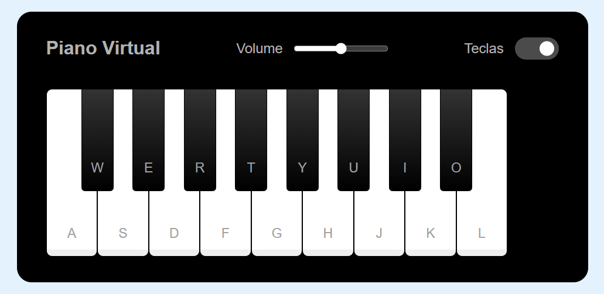

# PianoSimulator
Construindo um simulador de piano funcional.

Bem vindo(a) ao resultado do meu primeiro desafio na Trilha de Construção do Meu Portifólio da DIO! Onde construí um simulador de piano funcional usando HTML, CSS e Javascript.

[Clique aqui](https://htolentino.github.io/PianoSimulator/) para acessar o resultado final da página criada por mim a partir do desafio da DIO!

